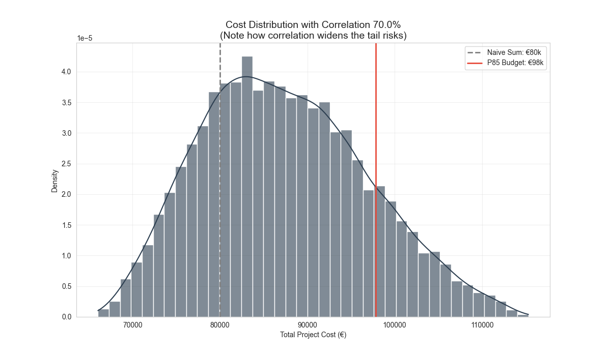

# 💰 Stochastic Cost Estimation (with Correlation)

### 🎯 Overview
Standard budgeting fails to capture "Tail Risk" (black swan events) and the correlation between asset prices. This project builds a **Monte Carlo Simulation Engine** to scientifically calculate the required budget contingency (Value at Risk).

### ⚙️ Key Innovation: Gaussian Copulas
Unlike simple simulations, this model uses **Cholesky Decomposition** to inject a Correlation Matrix (Rho = 0.7) into the random variables. This accurately models systemic inflation (e.g., when Steel prices rise, Concrete usually rises too), preventing underestimation of risk.

### 📊 Visualization

*(Fig 1: Probability distribution of final project cost. The P85 line indicates the recommended budget for 85% confidence.)*

### 🛠️ Tech Stack
* **Language:** Python
* **Math:** NumPy (Linear Algebra, Matrix Decomposition)
* **Statistics:** SciPy (Probability Distributions)

---
> ⚠️ **Note:** Source code is available upon request.
